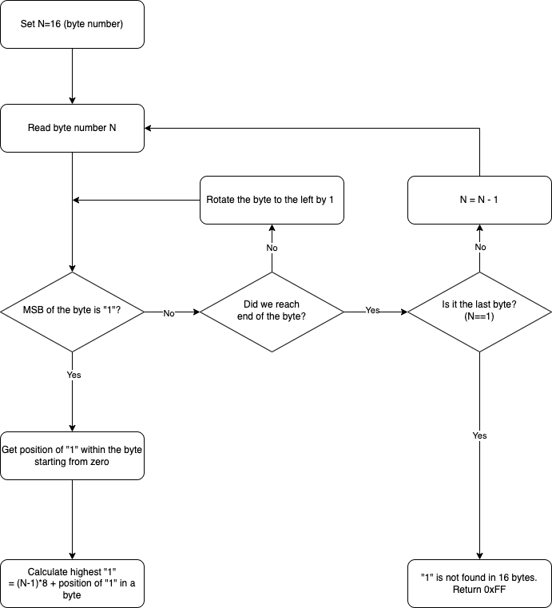

# Find highest one - Documentation

Author: Vladyslav Moisieienkov. **The solution is my own**.

The code can be also found in the [GitHub repository](https://github.com/VMois/micronto/tree/main/8051/find_highest_one).

We need to write a routine to find the position of the highest (most significant) "1" in 16 byte (128-bit) input.

## Description of the algorithm

Our output will be the position of the highest (most significant) "1", starting from zero.

We assume that the input is stored in a *big-endian* format. We will iterate over 16 bytes starting from the lower address (most-significant byte) and going up (least-significant byte). In the worst-case scenario (all zeros), we will need to loop over the input 16 times. For each byte:

1. Check if MSB is "1". If MSB is not "1", we rotate the byte to the left by one and check MSB again.
2. If no "1" is found in the byte, we move to the next less-significant byte and repeat step 1.
3. If "1" is located in the byte, we record its position within the byte. Then we calculate an offset based on how many remaining bytes were left to check and add the position of "1" we found earlier to determine the final position of the highest "1". 
4. If "1" is not found in 16 bytes, we return 0xFF.

The example for 3-byte (24-bit) input:

```
0010 0110 0111 0001 0011 1010 = 0x26 0x71 0x3A (big-endian)
```

1. We read most-significant byte - *0x26*;
2. Find "1" in a byte:

```
0010 0110 => MSB = 0 and is not "1", rotate to the left
0100 1100 => MSB = 0 and is not "1", rotate to the left
1001 1000 => MSB = 1; we rotated two times, so 8 - 2 = 6; we also need to substract 1 to get position starting from zero; the final result is 8 - 2 - 1 = 5.
```
3. Calculate remaining offset and add position of "1":

```
Remaining bytes to check = 2 (*0x71* and *0x3A* were left)
Final position of highest "1" = (Remaining byte to check * 8) + 5 = 2 * 8 + 5 = **21**.
```

Below you can find the flowchart:



## Details of implementation

The `CODE2IRAM` routine copies a test value from a code to data memory. The implementation is straighforward and was discussed during the class.

Routine `FIND_FIRST_1_NOMOD` is the main routine. It is iterating over 16 bytes and calling the `FIND_FIRST_1_IN_BYTE` routine for each byte. The `FIND_FIRST_1_NOMOD` checks the output of the `FIND_FIRST_1_IN_BYTE` and if "1" was found, `FIND_FIRST_1_NOMOD` calculates position of highest one and returns it.

Routine `FIND_FIRST_1_IN_BYTE` is responsible for finding position of highest "1" in *a byte*. We are using `JB` instruction to check if MSB of Accumulator (0xE7) is "1". If not, we rotate value to the left using `RL A` and repeat the process. If no "1" is found, *0xFF* is returned.

*Note:* `CALL` + `RET` operations consume 8-9 cycles. In case we need *extra* performance, it might make sense to remove the `FIND_FIRST_1_IN_BYTE` routine and move the code to the `FIND_FIRST_1_NOMOD` routine.

*Note:* We can add a mask to check if a byte has *any* "1". This should speed-up the execution in case input has a lot of zeroes at the beginning. This was not implemented.

## Testing

**Important:** due to some bug in simulator, when ASM file is loaded, one empty space is inserted at the beginning of file which triggers assembly error. The issue is visible, removing empty space solves the problem.

The solution provides 4 values to test:

- **BITFIELD_ADDR_CODE**, original input;
- **BITFIELD_ADDR_CODE_FIRST_ONE**, input value that has a single "1" bit as MSB of 16 byte (128-bit);
- **BITFIELD_ADDR_CODE_LAST_ONE**, input value that has a single "1" bit as LSB of 16 byte (128-bit);
- **BITFIELD_ADDR_CODE_NO_ONE**, input value that contains only "0" bits.
- **BITFIELD_ADDR_CODE_ANOTHER_EXAMPLE**, input value that has "1" in the second least-significant byte.

Modify high and low labels in `MAIN` to according label from above. The correct position for each input value is provided in the code comments.

## Resources

The material provided by professors in "Microcontroller Based Systems" course at BME.
